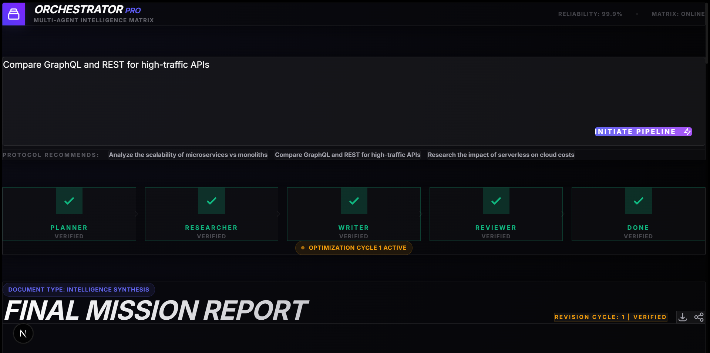

# Multi-Agent Task Orchestration System

A full-stack platform where multiple AI agents collaborate to research a topic and produce a summary report. The system orchestrates a pipeline of agents -- **Planner -> Researcher -> Writer -> Reviewer** -- with real-time progress visualization and a reviewer feedback loop.

## Architecture

```
┌─────────────────────────────────────────────────────┐
│  Frontend (Next.js / React)                         │
│                                                     │
│  ┌──────────┐   ┌───────────────┐   ┌────────────┐  │
│  │ TaskForm │ → │ PipelineView  │ → │ ReportView │  │
│  └──────────┘   │(SSE real-time)│   └────────────┘  │
│                 └───────────────┘                   │
│                                                     │
└───────────────────────────┬─────────────────────────┘
                            │ HTTP + SSE
┌───────────────────────────▼─────────────────────────┐
│  Backend (Python / FastAPI)                         │
│  ┌─────────────────────────────────────────────┐    │
│  │               Orchestrator                  │    │
│  │ Planner → Researcher → Writer → Reviewer    │    │
│  │                           ▲         │       │    │
│  │                           └─────────┘       │    │
│  │                        (feedback loop)      │    │
│  └─────────────────────────────────────────────┘    │
│                                                     │
│  POST /api/tasks  │  GET /api/tasks/{id}            │
│  GET  /api/tasks/{id}/stream  (SSE)                 │
└─────────────────────────────────────────────────────┘
```

## Quick Start

### Prerequisites
- **Python 3.10+**
- **Node.js 18+** and npm

### 1. Start the Backend

```bash
cd backend
pip install -r requirements.txt
python main.py
```

The API runs at `http://localhost:8001`. You can test it:

```bash
# Submit a task
curl -X POST http://localhost:8001/api/tasks \
  -H "Content-Type: application/json" \
  -d '{"query": "Research the pros and cons of microservices vs. monoliths"}'

# Check task status (replace <task_id>)
curl http://localhost:8001/api/tasks/<task_id>
```

### 2. Start the Frontend

```bash
cd frontend
npm install
npm run dev
```

Open `http://localhost:3001` in your browser.

### 3. Use the Application

1. Type a research query in the text area (or click an example)
2. Click **Run Agents** to start the pipeline
3. Watch agents process in real-time through the pipeline visualization
4. Expand each agent's output card to see its work
5. View the final report at the bottom

## Project Structure

```
multi-agent-orchestrator/
├── backend/
│   ├── main.py            # FastAPI app with API endpoints
│   ├── models.py          # Pydantic models and TaskStatus enum
│   ├── agents.py          # BaseAgent ABC + 4 agent implementations
│   ├── orchestrator.py    # Pipeline coordinator with retry logic
│   └── requirements.txt   # Python dependencies
├── frontend/
│   └── src/app/
│       ├── page.tsx        # Main page (state management, SSE subscription)
│       ├── api.ts          # API client functions
│       ├── types.ts        # TypeScript type definitions
│       ├── globals.css     # Design system and animations
│       ├── layout.tsx      # Root layout with metadata
│       └── components/
│           ├── TaskForm.tsx      # Task submission form
│           ├── PipelineView.tsx  # Agent pipeline visualization
│           ├── AgentOutput.tsx   # Expandable agent output cards
│           └── ReportView.tsx    # Final report renderer
├── DESIGN.md              # Architectural decisions & trade-offs
└── README.md              # This file
```

## Key Features

- **Real-time SSE streaming** - progress updates pushed to the browser as each agent completes
- **Reviewer feedback loop** - the Reviewer can send drafts back for revision (up to 2 cycles)
- **Retry logic** - each agent retries up to 3 times on failure
- **Pipeline visualization** - animated stages (pending / active / completed) with connecting lines
- **Expandable activity log** - see each agent's output, status, and metadata


